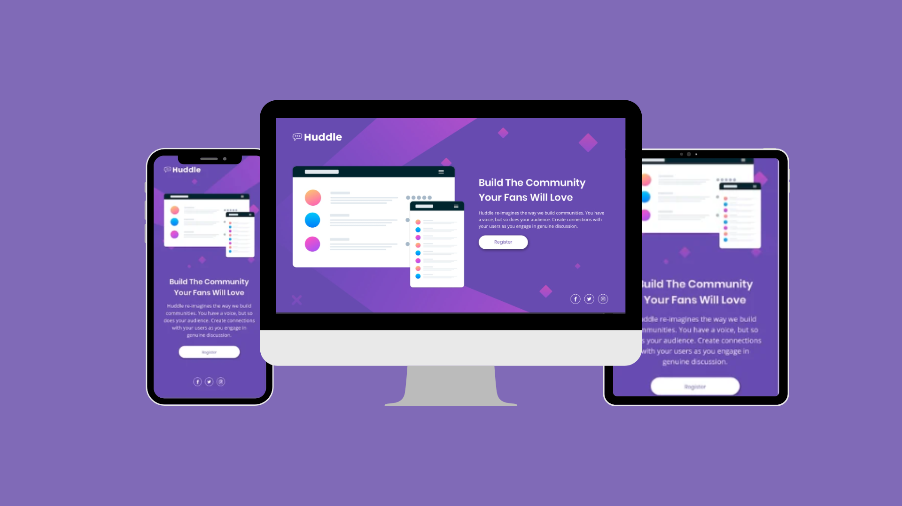

<h1 align="center">Huddle home - João 👾</h1>

<h4 align="center"><a href="https://jedev1.github.io/Huddle-pagina-home/">Confira o projeto aqui</a></h4>

---

## 💻 Sobre

Projeto feito no intuito de me apresentar, minhas copetências como front-end.

## 🤯 O site é composto por:

- **Home:** Minha apresentação;

## 🧠 Tecnologias utilizadas:

O site **ainda está em desenvolvimento**, pois estou em constante aprendizado. Mas até aqui utilizei as tecnologias:

    
    

---
